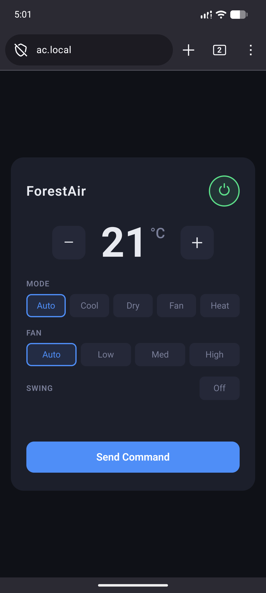

<div align="center">

# forestair-ir-rs
#### Rust implementation of the ForestAir AC IR protocol


</div>

## Project Description

This project implements an infrared transmitter for controlling [ForestAir](https://forestair.ca/) air conditioners. The transmitter is built using an ESP32 with an IR transmitter and the RMT (remote control) peripheral. It has been built after reverse-engineering an original ForestAir IR remote and reproducing its 35-bit pulse-distance encoded protocol.

## Table of Contents

<!-- mtoc-start -->

* [Screenshot](#screenshot)
* [Getting started](#getting-started)
  * [Hardware Requirements](#hardware-requirements)
  * [Wiring](#wiring)
  * [System prerequisites](#system-prerequisites)
  * [Setup Script](#setup-script)
  * [ESP-IDF Submodules](#esp-idf-submodules)
  * [User Permissions for Serial](#user-permissions-for-serial)
  * [Building and Flashing](#building-and-flashing)
  * [WiFi Provisioning](#wifi-provisioning)
* [ForestAir IR Protocol Overview](#forestair-ir-protocol-overview)
  * [IR Timing Specification](#ir-timing-specification)
  * [Pulse-Distance Encoding Diagram](#pulse-distance-encoding-diagram)
  * [Frame Format](#frame-format)
  * [Payload Format](#payload-format)
    * [AC Modes Encoding](#ac-modes-encoding)
    * [Fan Speeds Encoding](#fan-speeds-encoding)
    * [Tempearture Encoding](#tempearture-encoding)
    * [Transmission Order](#transmission-order)
  * [Example Payload and Encoding](#example-payload-and-encoding)
* [Troubleshooting](#troubleshooting)
* [License](#license)

<!-- mtoc-end -->

## Screenshot

The web UI:



## Getting started

### Hardware Requirements

* ESP32 (any variant with RMT peripheral)
* IR transmitter module; this project was built using the DUTTY Digital 38kHz IR Transmitter Sensor Module (or equivalent 3-pin Arduino-compatible IR transmitter module)

### Wiring

| Module Pin | ESP32 Pin |
|:----------:|:---------:|
|     DAT    |   GPIO14  |
|     VCC    |    3.3V   |
|     GND    |    GND    |

### System prerequisites

To get started with this project, make sure to install the following dependencies on your system.

Arch based (via pacman):
```bash
sudo pacman -S git cmake ninja python python-pip python-virtualenv dfu-util libusb ccache gcc pkg-config clang llvm libxml2 libxml2-legacy direnv
```

Debian based (via apt):
```bash
sudo apt-get install git wget flex bison gperf python3 python3-pip python3-venv cmake ninja-build ccache libffi-dev libssl-dev dfu-util libusb-1.0-0 direnv
```

### Setup Script

After having installed the dependencies and having cloned the repository, run the setup script at the root of the repository:
```bash
./setup.sh
```

### ESP-IDF Submodules

ESP-IDF uses git submodules for its dependencies. After your first cargo build, initialize them with:
```bash
git submodule update --init --recursive .embuild/espressif/esp-idf/v*/
```
> Note: The .embuild directory is created by cargo on first build, so this step must be done after building once.

### User Permissions for Serial

On Arch-based distros, the `uucp` group controls access to `/dev/ttyUSB*` devices (equivalent to `dialout` on Debian-based distros). Add your user to the appropriate group:

Arch-based:

```bash
sudo usermod -aG uucp $USER
newgrp uucp
```

Debian-based:

```bash
sudo usermod -aG dialout $USER
newgrp dialout
```
> Note: logging out and logging back in is probably preferable to using `newgrp` as it only applies to the current shell session, but it will work just as well.

### Building and Flashing

Connect your ESP32, then:

```bash
cargo run --release
```

### WiFi Provisioning

WiFi provisioning is handled by the [esp-wifi-provisioning](https://github.com/Dwarf1er/esp-wifi-provisioning) crate, also developed by the author of this project. On first boot, the ESP32 will broadcast a WiFi access point named `ForestAir-Setup`. Connect to it and follow the provisioning flow to configure your home network credentials. Credentials are stored in NVS flash and persist across reboots, so this only needs to be done once. Once connected to your network, the web UI is accessible at http://ac.local.

## ForestAir IR Protocol Overview

The ForestAir AC units use a 35-bit IR protocol with the following spec:
* 38 kHz carrier frequency
* Pulse-distance encoding with LSB-first transmission
* Fixed header and parametrized payload
* Transmission with no repeat frames (one transmission of the full state after each button press)

### IR Timing Specification

|     Parameter     |          Value         |
| :---------------: | :--------------------: |
| Carrier frequency |         38 kHz         |
|     Duty cycle    |           33%          |
|      Bit mark     |         650 µs         |
|  Logic "0" space  |         550 µs         |
|  Logic "1" space  |         1650 µs        |
|      Stop bit     | 650 µs mark + no space |

### Pulse-Distance Encoding Diagram

```plaintext
Bit '0'  ───650µs HIGH───550µs LOW──────────
Bit '1'  ───650µs HIGH──────────1650µs LOW──
```

### Frame Format

A full IR frame will consist of the following:
* Header: 9000 µs mark + 4450 µs space
* 35 data bits (see Payload Format)
* Stop bit: 650 µs mark + no space

The first bits are always 0x250000 (a fixed constant, determined by reverse-engineering, its meaning is unknown). The remaining bits carry the parametrized payload.

### Payload Format

|  Bits |    Field    | Size | Description               |
| :---: | :---------: | ---- | ------------------------- |
|  0–2  |    acMode   | 3    | Operating mode            |
|   3   |    onOff    | 1    | Power state               |
|  4–6  |   fanMode   | 3    | Fan speed                 |
|   7   |    swing    | 1    | Swing on/off              |
|  8–11 | temperature | 4    | 16–30 °C encoded as index |

#### AC Modes Encoding

| Value |     Mode    |
| :---: | :---------: |
|   0   |     Auto    |
|   1   |     Cool    |
|   2   |  Dehumidify |
|   3   | Ventilation |
|   4   |     Heat    |


#### Fan Speeds Encoding

| Value |  Speed |
| :---: | :----: |
|   0   |  Auto  |
|   1   |   Low  |
|   2   | Medium |
|   3   |  High  |

#### Tempearture Encoding

| Value |  Temperature |
| :---: | :----------: |
|   0   |     16°C     |
|   1   |     17°C     |
| [...] |     [...]    |
|  14   |     30°C     |


#### Transmission Order

Least-significant-bit first (LSB first)

### Example Payload and Encoding

Example settings:
```plaintext
Mode:        Ventilation (3)
Power:       On (1)
Fan:         Low (1)
Swing:       Off (0)
Temperature: 24°C → index 8
```

Payload fields:
```plaintext
acMode      = 3     (bits 0–2)
onOff       = 1     (bit 3)
fanMode     = 1     (bits 4–6)
swing       = 0     (bit 7)
temperature = 8     (bits 8–11)
reserved    = 0     (bits 12–15)
```

Final frame:
```markdown
010 0101 0000 0000 0000 0000  0100 0  011  1  001
├───────────────────────────┤ ├──┤ │  ├──┤ │   └───  Mode  (001)
           Fixed                │  │    │  └───────  Power (1)
                                │  │    └──────────  Fan   (011)
                                │  └───────────────  Swing (0)
                                └──────────────────  Temp  (0100)
```

## Troubleshooting

My ForestAir AC unit doesn't seem to turn on if the "Heat" mode is selected, whether on the original remote or with my ESP32. Therefore, if your AC doesn't turn on:
* Try selecting: `Ventilation`, `Cool`, or `Auto` instead
* Confirm temperature index is between 16°C-30°C

## License

This software is licensed under the [MIT license](LICENSE).
